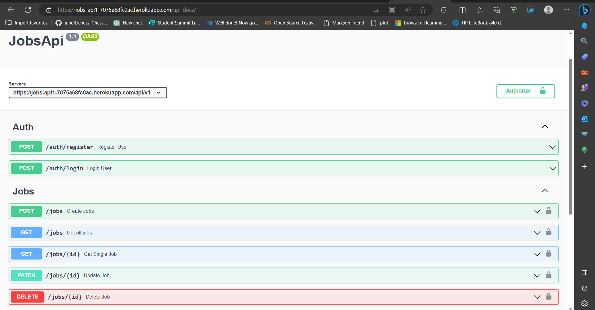

# Jobs API

This README provides an overview of the **Jobs API** along with instructions on how to use it. The API allows users to register, log in, create, update, retrieve, and delete job listings. It also provides Swagger documentation for easy reference.

## Table of Contents

- [Swagger Documentation](#swagger-documentation)
- [Prerequisites](#prerequisites)
- [Getting Started](#getting-started)
- [Database Connection](#database-connection)
- [Middleware](#middleware)
- [Models](#models)
- [Controllers](#controllers)
- [API Endpoints](#api-endpoints)
- [Authentication](#authentication)
- [Swagger YAML](#swagger-yaml)


## Swagger Documentation

You can access the Swagger documentation for this API at `https://jobs-api1-7075a68fc0ac.herokuapp.com/api-docs/`. The Swagger UI provides detailed information about the API endpoints, request schemas, and example requests and responses.


## Prerequisites

Before you can use the **Jobs API**, make sure you have the following installed:

- Node.js (v14 or higher)
- MongoDB
- Git

## Getting Started

1. Clone the repository to your local machine:

   ```bash
   git clone <repository-url>
   ```

2. Install the dependencies:

   ```bash
   npm install
   ```

3. Set up environment variables by creating a  folder `config` and create a `config.env` file in the config folder. Use this format
  ```
  # MongoDB connection URI
  MONGO_URI=your_mongodb_uri_here

  # JWT secret key for token generation
  JWT_SECRET=your_secret_key_here

  # JWT token expiration time (e.g., 1d for 1 day, 1h for 1 hour)
  JWT_LIFETIME=1d

  # Port for the server to listen on
  PORT=3000
  ```

4. Start the server:

   ```bash
   npm start
   ```

The API should now be running on `http://localhost:<port>`. The default port is 3000.

## Database Connection

The API connects to a MongoDB database using Mongoose. The database connection is managed in the `db/connect.js` file.

## Middleware

The API includes several middleware functions for security and request handling:

- `helmet`: Provides security-related HTTP headers.
- `cors`: Enables Cross-Origin Resource Sharing.
- `xss-clean`: Protects against cross-site scripting (XSS) attacks.
- `express-rate-limit`: Implements rate limiting to prevent abuse of the API.
- `authentication`: Middleware to verify JWT tokens and authenticate users.
- `not-found`: Handles requests for non-existent routes.
- `error-handler`: Centralized error handling and response formatting.

## Models

The API uses two mongoose models:

### User Model

- Stores user information including name, email, and hashed password.
- Provides methods for creating JWT tokens and comparing passwords.

### Job Model

- Stores job listings with details like company name, position, and status.
- Associated with a user through the `createdBy` field.

## Controllers

The API controllers handle request processing:

### Auth Controller

- `register`: Handles user registration.
- `login`: Handles user login.

### Jobs Controller

- `getAllJobs`: Retrieves all job listings for the authenticated user.
- `getJob`: Retrieves a single job listing by its ID.
- `createJob`: Creates a new job listing.
- `updateJob`: Updates a job listing by its ID.
- `deleteJob`: Deletes a job listing by its ID.

## API Endpoints

### Authentication

- **POST /api/v1/auth/register**
  - Register a new user.
  - Example Request Body:

    ```json
    {
      "name": "Favour",
      "email": "favour01@gmail.com",
      "password": "yourpassword"
    }
    ```

- **POST /api/v1/auth/login**
  - Log in an existing user.
  - Example Request Body:

    ```json
    {
      "email": "favour01@example.com",
      "password": "yourpassword"
    }
    ```

### Jobs

- **POST /api/v1/jobs**
  - Create a new job listing (requires authentication).
  - Example Request Body:

    ```json
    {
      "company": "Microsoft",
      "position": "Software engineer intern"
    }
    ```

- **GET /api/v1/jobs**
  - Retrieve all job listings for the authenticated user.

- **GET /api/v1/jobs/{id}**
  - Retrieve a single job listing by its ID (requires authentication).

- **PATCH /api/v1/jobs/{id}**
  - Update a job listing by its ID (requires authentication).
  - Example Request Body:

    ```json
    {
      "company": "Microsoft",
      "position": "Data scientist intern"
    }
    ```

- **DELETE /api/v1/jobs/{id}**
  - Delete a job listing by its ID (requires authentication).

## Authentication

The API uses JSON Web Tokens (JWT) for authentication. When a user registers or logs in, a JWT token is provided in the response. To authenticate for protected routes (jobs-related endpoints), include this token in the `Authorization` header of your requests with the format: `Bearer <token>`.

## Swagger YAML

The Swagger documentation is defined in the `swagger.yaml` file. It provides detailed information about the API endpoints, request and response schemas, and example data.

Feel free to explore and interact with the API using the provided Swagger documentation or by making HTTP requests as described in the API endpoints section.

## Special Thanks

I would like to express my heartfelt gratitude to [FreeCodeCamp](https://www.youtube.com/@freecodecamp) and [John Smilga](https://www.youtube.com/codingaddict) for providing exceptional educational resources. This project would not have been possible without their insightful tutorials and guidance. Their dedication to sharing knowledge and empowering learners like me is truly commendable.